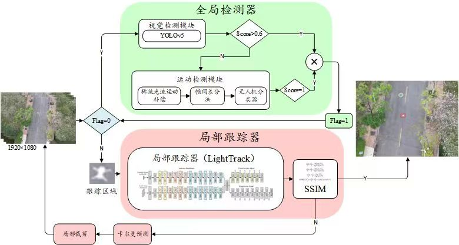
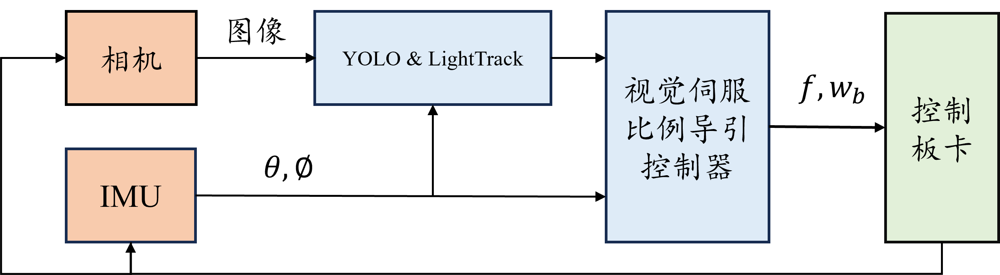
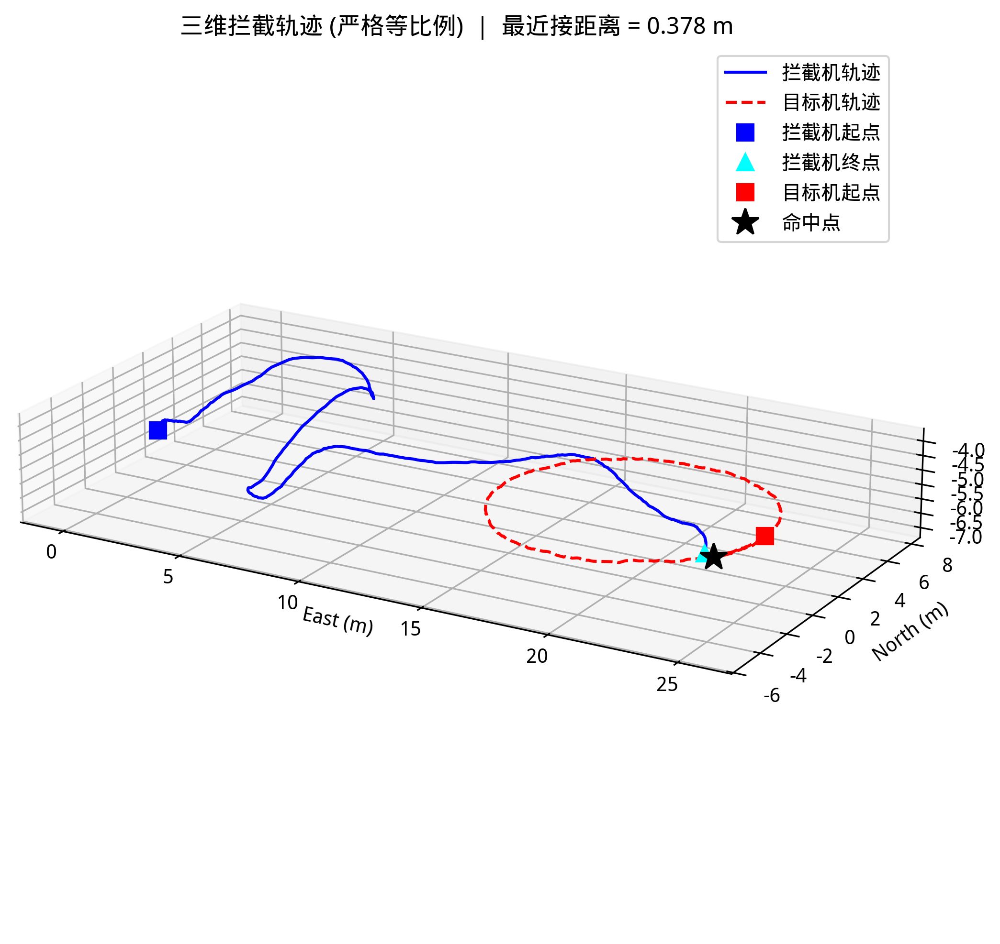
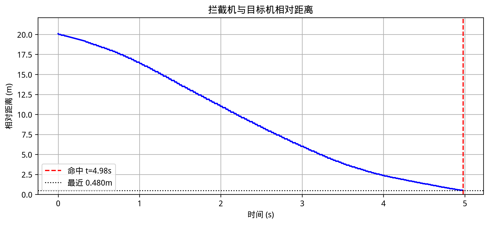
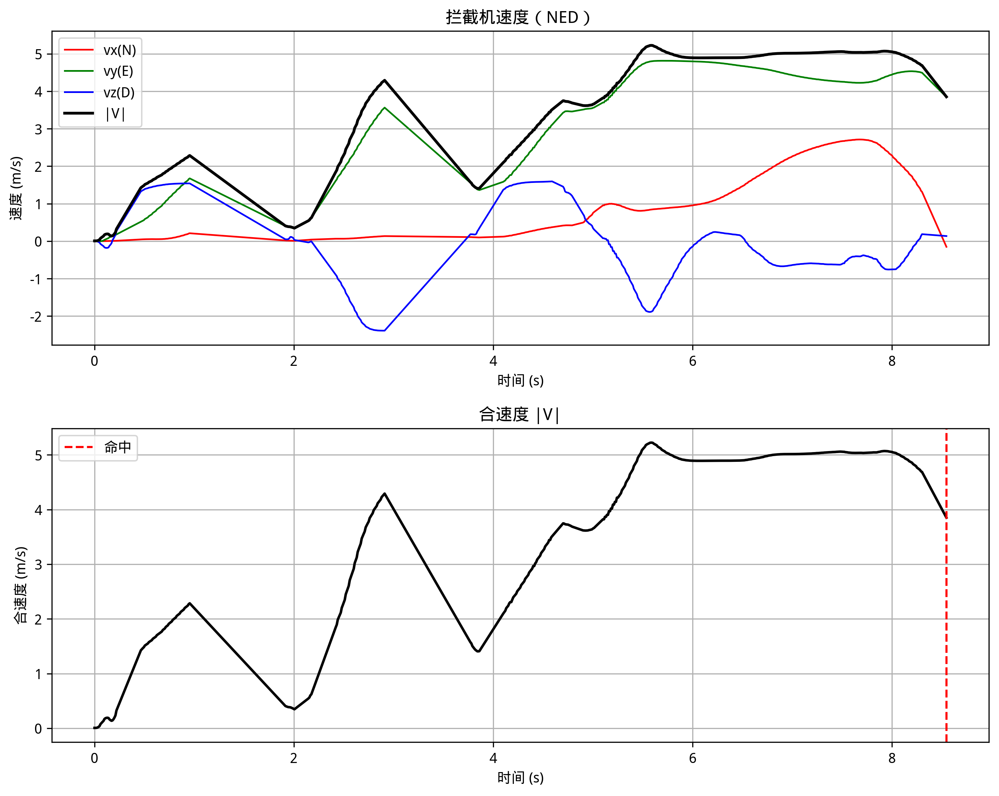
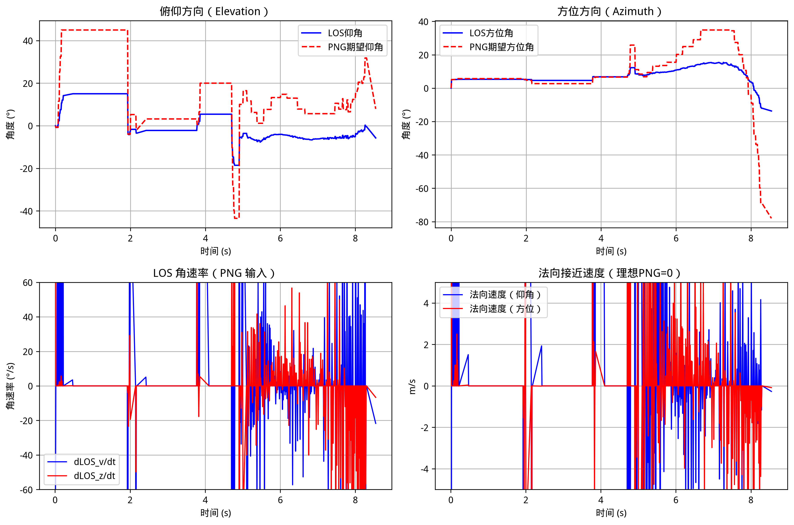
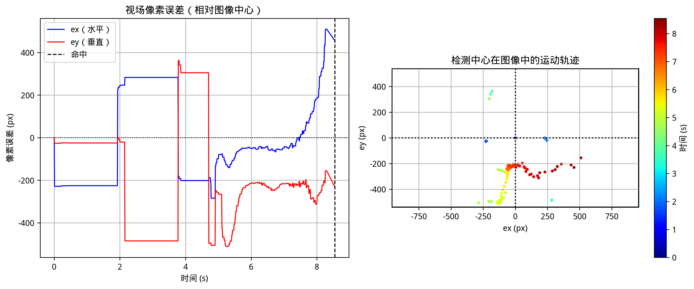
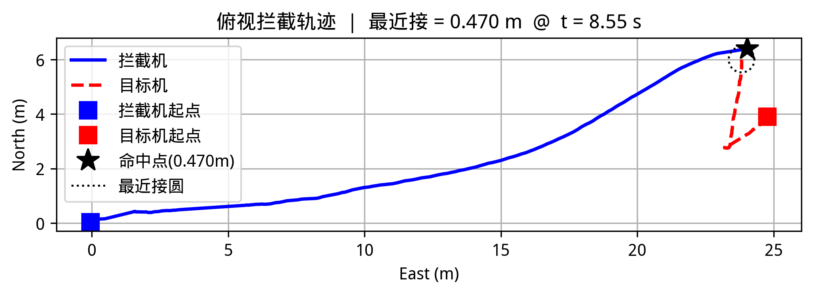

# Autonomous Intercept Drone
### 基于视觉伺服的自主拦截无人机系统 (Autonomous Intercept Drone with Image-based Visual Servo)

<div align="center">

[](https://www.bilibili.com/video/BV1M8QVYHE39/?spm_id_from=333.1387.homepage.video_card.click)
[](https://px4.io/)
[](https://docs.ros.org/en/humble/)
[](https://developer.nvidia.com/tensorrt)
[](https://github.com/ultralytics/ultralytics)

</div>

> 本项目是一个面向自主无人机拦截任务的实验验证平台，集成了视觉感知、目标检测、比例导引（PNG）算法及飞行控制方法。该项目旨在为无人机自主拦截、制导算法研究及视觉伺服控制提供一套完整的仿真参考方案，适用于学习与学术研究。
---

## 项目简介

该系统在 ROS 2 环境下开发，结合 PX4 固件与 Gazebo 仿真器，实现了从目标发现到仿真拦截的全链路闭环。主要功能包括：

*   **视觉目标检测**：利用训练的 YOLO 模型和跟踪模型实时识别并跟踪视场内的无人机目标。
*   **比例导引制导**：基于比例导引律（Proportional Navigation Guidance, PNG）生成拦截轨迹，实现对动态目标的精确前置拦截。
*   **仿真验证体系**：基于 PX4 软件在环（SITL）搭建，支持在 Gazebo 环境中进行算法的离线验证与参数调优。
*   **数据分析工具**：内置运动学与视觉指标记录脚本，用于定量评估制导律精度与视觉追踪稳定性。

---

## 仿真演示

### 1. 动态拦截全过程
<div align="center">
  
  <p><i>（通过 PNG 算法预判目标航迹，实现精准的物理碰撞拦截）</i></p>
  <p><b>📺 <a href="https://www.bilibili.com/video/BV1M8QVYHE39/">点击此处前往 Bilibili 观看完整高清演示视频</a></b></p>
</div>

### 2. 小目标无人机检测框架
<div align="center">
  
  <p><i>（针对无人机“点目标”优化的视觉处理流程）</i></p>
</div>

---

## 系统架构与逻辑

系统采用 ROS 2 分层架构，确保了极高的灵活性与实时性：

<div align="center">
  
</div>

| 模块名称 | 功能描述 | 关键包 | 状态/备注 |
| :--- | :--- | :--- | :--- |
| **感知层** | 目标检测、像素误差计算、视线角提取 | `uav_vision_dectect`, `uav_vision_png` | **当前主方案** |
| **制导层** | PNG 导引率计算、前置量补、轨迹生成 | `uav_png_intercept` | **纯PNG方案 (不依赖视觉)** |
| **控制层** | PX4 Offboard 接口、速度/姿态闭环控制 | `uav_vehicle_controller`, `px4_ros_com` | 核心控制底座 |
| **仿真层** | 目标机动态模拟、拦截环境生成 | `uav_target_sim` | 仿真支持 |
| **早期方案** | 基于图像的视觉伺服控制方案 | `uav_ibvs_control` | **已放弃 (代码仅供保留参考)** |

---

## 拦截性能量化分析

以下展示了系统在典型拦截任务中的表现，可作为算法优化的参考基准：

### 运动学性能
<div align="center">
  <table>
    <tr>
      <td><br><b>3D 拦截轨迹图</b></td>
      <td><br><b>相对距离收敛曲线</b></td>
      <td><br><b>拦截机速度矢量</b></td>
    </tr>
    <tr>
      <td>展示了 3D 空间内的截击前置量</td>
      <td>验证拦截距离最终收敛至 &lt;0.2m</td>
      <td>反映了制导律对推力的高效利用</td>
    </tr>
  </table>
</div>

### 视觉追踪表现
<div align="center">
  <table>
    <tr>
      <td><br><b>视线角 (LOS) 演变</b></td>
      <td><br><b>视觉中心追踪误差</b></td>
      <td><br><b>2D 俯视截击路径</b></td>
    </tr>
    <tr>
      <td>导引规律的收敛稳定性分析</td>
      <td>检测算法在动态过程中的稳健性表现</td>
      <td>典型前置量补效果展示</td>
    </tr>
  </table>
</div>

---

## 快速上手

### 1. 环境依赖
*   **ROS 2 Version**: Humble
*   **PX4 Firmware**: v1.16
*   **Dependencies**: OpenCV, PyTorch, colcon

### 2. 编译项目
```bash
# 进入工作空间并编译
cd ros2_ws
colcon build --symlink-install
source install/setup.bash
```

### 3. 运行拦截任务 (步骤序列)
请按以下顺序在不同终端中运行各节点：

1. **启动目标机仿真**:
   ```bash
   ros2 run uav_target_sim uav_target_sim
   ```
2. **启动视觉检测**:
   ```bash
   ros2 run uav_vision_dectect uav_vision_dectect
   ```
3. **启动视觉制导拦截**:
   ```bash
   ros2 run uav_vision_png uav_vision_png
   ```

---

---

> **项目维护者注**：如果您需要更多关于算法推导（PNG）的细节，请参考各功能包下的 `include/` 头文件或联系开发团队。
