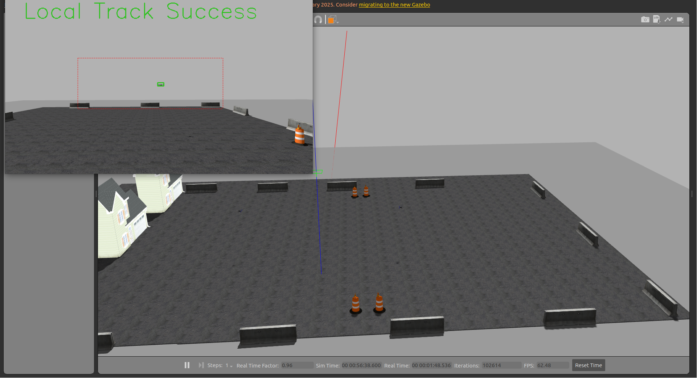

# Autonomous Intercept Drone
### 基于视觉伺服的自主拦截无人机系统 (Autonomous Intercept Drone with Image-based Visual Servo)

<div align="center">

[](https://px4.io/)
[](https://docs.ros.org/en/humble/)
[](https://developer.nvidia.com/tensorrt)
[](https://github.com/ultralytics/ultralytics)

</div>

**Autonomous Intercept Drone** 是一个基于 **Image-based Visual Servo (IBVS)** 技术的自主拦截无人机项目。本项目结合了先进的小目标检测算法与 PX4/Gazebo 仿真环境，实现了对空中移动目标的自主识别、追踪与拦截。

---

## 🏗️ 系统架构 (System Architecture)

### 1. 小目标无人机检测框架
针对远距离、弱小无人机目标的检测优化方案，确保在复杂背景下也能精准识别目标。

<div align="center">
  
</div>

### 2. 无人机拦截方案框架
基于视觉反馈的闭环控制策略，包含状态估计、目标预测与伺服控制逻辑。

<div align="center">
  
</div>

---

## 📺 仿真演示 (Simulation & Demos)

我们提供了完整的仿真视频，展示了无人机从搜索、锁定到拦截的全过程。

<div align="center">

[](https://www.bilibili.com/video/BV1M8QVYHE39/?spm_id_from=333.1387.homepage.video_card.click)



</div>

---

## 🛠️ 仿真环境搭建 (Simulation Environment)

本项目依赖 **PX4-Autopilot** 与 **Gazebo Classic**。在运行以下命令前，请确保已正确配置 PX4 开发环境及 ROS 2 通信桥接。

### 1. 启动多机仿真 (Interception Scenario)
加载两架无人机模型：一架搭载深度相机的拦截机 (`iris_depth_camera`) 和一架目标机 (`iris`)。

```bash
# 在 PX4-Autopilot 根目录下运行
./Tools/simulation/gazebo-classic/sitl_multiple_run.sh -s "iris_depth_camera:1, iris:1"
```

### 2. 建立通信 (UDP Bridge)
启动 MicroXRCEAgent 以建立 PX4 与 ROS 2 之间的 UDP 通信，端口为 8888。

```bash
MicroXRCEAgent udp4 -p 8888
```

### 3. 单机仿真 (Single Drone Test)
仅用于测试单机飞行控制逻辑或环境验证。

```bash
make px4_sitl gazebo-classic
```